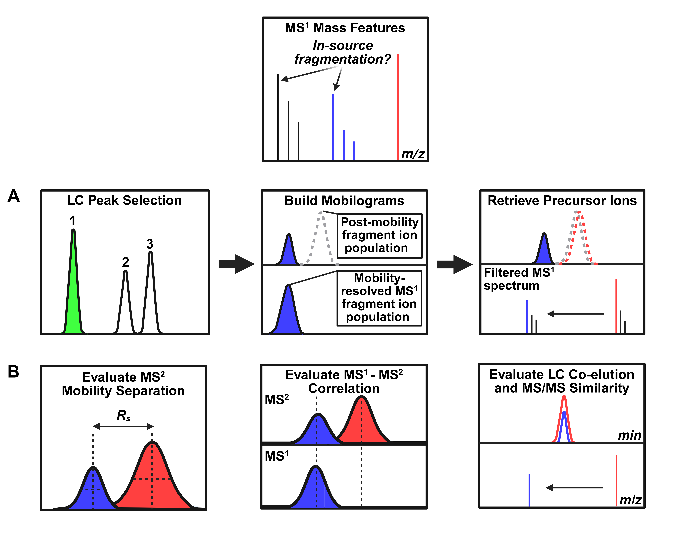

## IMFrag

IMFrag is a Jupyter notebook-based workflow designed to facilitate the investigation of in-source fragments (ISFs) in ion mobility-enabled data independent (IM-DIA) mass spectrometry (MS) datasets. This notebook integrates data conversion, processing, and visualization tools that enables researchers to closely evaluate the gas-phase mobility behavior of suspected ISFs and other ion types. 


## How to Use IMFrag

IMFrag is provided as a Jupyter notebook to be run on your local machine. Follow the steps below to install the requirements using [conda](https://docs.conda.io/projects/conda/en/stable/index.html) and launch the [imfrag_demo](imfrag_demo.ipynb) notebook.

Download the repo as a ZIP file and extract it locally, then navigate to:
```bash
xulab_software/imfrag
```

Alternatively, clone the repo using Git:
```
git clone https://github.com/libinxulab/xulab_software.git
cd xulab_software/imfrag
```

Option A (recommended): Create and activate a [conda](https://docs.conda.io/projects/conda/en/stable/index.html) environment:
```bash
conda env create -f environment.yml
conda activate imfrag
```

Option B: Install dependencies using pip:
```bash
conda create -n IMFrag pthon=3.10
conda activate imfrag 
```
Then install the core dependencies listed in `requirements.txt`:
```bash
pip install -r requirements.txt
```

IMFrag is powered by [DEIMoS](https://pubs.acs.org/doi/10.1021/acs.analchem.1c05017), the open-source Python API developed by Pacific Northwest National Laboratory, for processing multidimensional mass spectrometry data. DEIMoS must be [properly installed](https://deimos.readthedocs.io/en/latest/getting_started/installation.html) prior to using IMFrag. Note that the imfrag virtual environment created above should already contain the required dependencies for both IMFrag and DEIMoS. 

The current version of IMFrag also requires that native `.raw` files be converted to the `mzML` format. This step can be achieved with the standalone [Waters2mzML](https://github.com/AnP311/Waters2mzML/releases) tool; detailed instructions are provided in the notebook. 

## References

1. DEIMoS, version 1.6.1 http://github.com/pnnl/deimos (accessed Nov 2025)
2. Colby, S.M., Chang, C.H., Bade, J.L., Nunez, J.R., Blumer, M.R., Orton, D.J., Bloodsworth, K.J., Nakayasu, E.S., Smith, R.D, Ibrahim, Y.M. and Renslow, R.S., 2022. DEIMoS: an open-source tool for processing high-dimensional mass spectrometry data. Analytical Chemistry, 94(16), pp.6130-6138.
3. Waters2mzML, version 1.2.0 https://github.com/AnP311/Waters2mzML/releases (accessed Nov 2025)

## Example Data
Example `HDF5` raw files and associated target lists are provided in the `imfrag/example` folder. 
Additional `.raw` IM-DIA data files used to develop and assess IMFrag are freely available for download at [MassIVE](doi:10.25345/C5TQ5RT4W]).

## Contact Information
ryan97@uw.edu (Ryan Nguyen @ Xu Lab, UW Medicinal Chemistry)

## Overview 
IMFrag may be applied to individual features of interest, integrated into untargeted IM-MS analysis pipelines, or used to support the development of ISF-derived MS/MS spectral libraries. 

The workflow was built on simple drift time alignment principles. First, ISFs formed prior to the IM drift tube are transmitted to the IM cell independently of their precursors, resulting in mobility-resolved features within low-energy (i.e., MS1) acquisition scans. In contrast, the secondary generation of these fragments via post-mobility collision induced dissociation (CID) produces high-energy (i.e., MS2) features that are drift time-aligned with their precursors. 

### Data File Conversion
Users are first guided through a series of data conversion steps, producing `mzML` (via [Waters2mzML](https://github.com/AnP311/Waters2mzML/releases)) and `HDF5` (via [DEIMoS](https://pubs.acs.org/doi/10.1021/acs.analchem.1c05017)) files from the native `.raw` format. Please note that IMFrag has only been tested and validated with Waters HDMSE data; different vendor formats will likely work with minor adjustments, as long as collision energy is selectively added to the corresponding post-mobility region during MS2 analysis. 

### Input Target List
IMFrag currently requires an input target list containing MS1 features of interest. The target list should be in the form of an Excel spreadsheet with the following headers and information:

| Feature Name | Target m/z |      File Name      |              
|:------------:|:----------:|:-------------------:|
| Plasma_1SF_1 |  144.0808  | Plasma_203_HDMSE.h5 |
| Plasma_ISF_2 |  188.0707  | Plasma_203_HDMSE.h5 |

A template is provided in the `imfrag/example` folder for your convenience. 

### Peak Picking in the LC and IM Dimensions
Once the native `.raw` data files have been correctly converted, peaks around each target m/z are picked in both the LC and IM dimensions. 


Within each identified LC peak, mobilograms are constructed from both the MS1 and MS2 acquisition scans. This approach preserves any separation achieved in the LC dimension by gating IM extraction to the selected chromatographic peak, thereby minimizing overlap from co-eluting analytes and reducing interference from unrelated ions. 

Following peak picking, the MS1 and MS2 mobilograms for each target feature are displayed to facilitate the recognition of mobility signatures unique to IM-DIA ISF ions. In cases where fragments are formed prior to IM separation (e.g., via ISF or other pre-mobility processes), these ions are expected to be transmitted to the drift tube independently of their precursors and therefore exhibit distinct drift times within MS1 acquisition scans. Subsequent post-mobility generation of these fragments via CID generates MS2 features that are drift time-aligned with their precursors, and, in the case of ISF, complex mobilogram profiles containing distinct ion populations arising from both pre- and post-mobility formation. 

Depending on the user's objective, the observation of these mobility patterns alone may be sufficient for correctly identifying features of interest as ISFs. A few caveats should be noted, however. First, in cases involving small neutral losses, the IM resolving power may not always result in observable separation between ISF and precursor ion populations. IM alone may therefore be insufficient to unambiguously distinguish pre-mobility fragments from those formed intentionally via post-mobility dissociation. 

Furthermore, the complex MS2 mobilogram profiles described above are dependent on both pre- and post-mobility fragmentation pathways; as such, unstable ISFs that are observable in low-energy MS1 acquisition scans may decompose prior to detection in subsequent MS2 experiments, leading to mobility-resolved MS1 features but MS2 mobilograms dominated by the post-mobility popualation. 

Conversely, candidate ISFs that form exclusively prior to the IM drift tube would not be easily recognized using the principles of pre- and post-mobility alignment described here. 

### Retrieval of Candidate Precursor Ions 
In addition to LC and IM peak picking tools, IMFrag enables researchers to further investigate the potential origins of candidate ISFs. 


The origins of candidate ISFs displaying complex MS2 mobilograms can be elucidated through precursor-fragment ion relationships that are preserved by post-mobility CID. First, the drift time window of the post-mobility ion population is determined, removing all misaligned features that were sufficiently resolved from the ISF's true precursor(s) in the IM drift tube. A small drift time offset is then applied to accurately project the drift time window in MS1 space, generating a mobility-filtered MS1 mass spectrum that ideally only contains ions from which the candidate ISF may have dissociated. 

IMFrag also leverages the spectral deconvolution tools provided by [DEIMoS](https://pubs.acs.org/doi/10.1021/acs.analchem.1c05017) to enable comparisons between the MS/MS spectra of candidate ISFs and their precursor ions. As described [Guo et al.](https://pubs.acs.org/doi/10.1021/acs.analchem.1c01644), ISFs are expected to share common fragments with the ions from which they formed; as such, MS/MS similarity is a simple but powerful metric to further confirm ISF features in IM-DIA workflows.

Because precursor-fragment ions relationships are, by design, not directly preserved in DIA experiments, IMFrag does not assume the identity of any chemical feature prior to analysis. Instead, the pseudo-MS/MS spectra for each target m/z and their associated ions - identified using the mobility-guided extraction approach described above - are separately constructed via deconvolution in both LC and IM space. MS/MS spectra may then be compared to confirm the presence of overlapping fragments between ISFs and their precursors. 

### ISF Confidence Scoring

IMFrag assigns confidence labels to candidate ISFs using two complementary scoring frameworks. The first is based on IM separation and alignment behavior, and the second leverages techniques described by [Guo et al.](https://pubs.acs.org/doi/10.1021/acs.analchem.1c01644) based on LC co-elution and MS/MS similarity patterns. Within the IM framework, drift-time resolution $R_s$ between MS2 mobilogram peaks and the correlation between corresponding MS1 and MS2 mobility profiles are evaluated. High-confidence ISFs are defined as features exhibiting (i) high MS2 drift-time resollution and (ii) low Pearson correlatoin between MS1 and MS2 mobilogram profiles due to the presence of a second, later-arriving MS2 ion population generated via post-mobility CID. IMFrag also incorporates a fallback strategy for scenarios where IM separation is insufficient to confidently label an ISF based exclusively on mobility behavior. This strategy incorporates a traditional LC-HRMS framework, requiring LC co-elution and the presence of the candidate ISF in the putative precursor's MS/MS spectrum (within a pre-defined mass threshold). The latter metric is evaluted usign the reverse dot product. 



#### Ion Mobility Scoring Metrics

These IM-based parameters and ISF scoring metrics are based on the fitted Gaussian parameters from the MS1 and MS2 mobility profiles.

| Metric | Formula | Interpretation |
|:------:|:-------:|:--------------:|
| `drift_resolution` ($R_s$) | \|Δμ\| / 0.5·(FWHM_MS1 + FWHM_MS2) | Separation between ion populations in FWHM units. $R_s$ ≥ 1.0 = baseline-resolved; 0.5–1.0 = partial |
| `drift_delta_pct` | 100·\|Δμ\| / μ_MS1 | Percent drift-time difference between MS1 and MS2 centers |
| `r_im` | μ_MS1 / FWHM_MS1 | IM resolving power |
| `min_resolvable_delta_ms` | μ_MS1 / r_im |Pairs with Δdrift below this value cannot be resolved, regardless of threshold |
| `mobility_profile_pearson_r` ($r$) | Pearson correlation coefficient $r$ between MS1 and offset-corrected MS2 mobilograms | Features with low Pearson correlation support the presence of distinct mobility profiles |
| `ms1_unaligned_intensity_ratio` | MS1 mobiligram area in unaligned drift window / aligned drift window | The percentage of MS1 fragment signal exhibiting non-overlapping mobility behavior with the putative precursor |
| `im_resolvable` | $R_s$ ≥ 0.5 (default) | Adjustable threshold that, if not satisfied, initiates evaluation based on spectral similarity (see below)|

#### Spectral Similarity Scoring Metrics

When IM resolution is insufficient for confident ISF classification, a fallback strategy based on traditional LC co-elution and MS2 similarity patterns is employed.

| Metric | Definition | 
|:------:|:----------:|
| `lc_coelution_pearson_r` | Pearson $r$ between MS1 extracted ion chromatograms of the candidate ISF and its top precursor candidate 
| `ms2_subspectrum_match` | Evaluation of the candidate ion's presence in the precursor MS2 spectrum (within 0.02 Da) 
| `ms2_reverse_dot_product` | Cosine similarity between the candidate ion's MS2 spectrum and the precursor MS2 spectrum
| `ms2_matched_ratio` | Fraction of candidate MS2 peaks matched in the precursor's MS2 

#### Composite Confidence Label

Following evaluation, every candidate receives a single `isf_confidence` label based on the criteria described below. `Note that these parameters may require significant tuning depending on IM resolving power. Additional studies are warranted to determine optimal starting conditions for ISF evaluation.`

| Label | Criteria |
|:-----:|:--------:|
| `high_im` | $R_s$ ≥ 1.0 AND mobility_profile_pearson_r ≤ 0.6 AND ms1_unaligned_intensity_ratio ≥ 0.3 |
| `medium_im` | 0.5 ≤ $R_s$ < 1.0 |
| `high_spectral` | lc_coelution_pearson_r ≥ 0.8 AND ms2_subspectrum_match AND reverse DP > 0.5 OR matched ratio > 0.7 |
| `medium_spectral` | lc_coelution_pearson_r ≥ 0.8 AND ms2_subspectrum_match |
| `low` | lc_coelution_pearson_r ≥ 0.8  |
| `none` | No criteria met in either the IM or spectral similarity frameworks |


